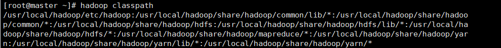

# Doceker 安装hadoop集群

## 1.环境准备

jdk1.8 https://www.oracle.com/technetwork/java/javase/downloads/jdk8-downloads-2133151.html

hadoop2.10.1 https://mirrors.tuna.tsinghua.edu.cn/apache/hadoop/common/stable2/hadoop-2.10.1.tar.gz   （清华大学镜像）下载速度快

## 2.构建centos-ssh镜像

首先找一个用于储存Dockerfile的文件夹，后面构建的镜像都要放在相应的文件夹中，方便管理

```bash
#1.首先创建Dockerfile
mkdir centos-ssh
cd centos-ssh
vim Dockerfile  
```


```bash
#2.将下面的内容写进Dockerfile
#centos8版本没有yum
FROM centos:7 

# 镜像的作者  
MAINTAINER ggtoms<zhahanpi@gmail.com>

# 安装openssh-server和sudo软件包，并且将sshd的UsePAM参数设置成no  
RUN yum install -y openssh-server sudo
RUN sed -i 's/UsePAM yes/UsePAM no/g' /etc/ssh/sshd_config
#安装openssh-clients
RUN yum  install -y openssh-clients

# 添加测试用户root，密码root，并且将此用户添加到sudoers里  
RUN echo "root:root" | chpasswd
RUN echo "root   ALL=(ALL)       ALL" >> /etc/sudoers
RUN ssh-keygen -t dsa -f /etc/ssh/ssh_host_dsa_key
RUN ssh-keygen -t rsa -f /etc/ssh/ssh_host_rsa_key
# 启动sshd服务并且暴露22端口  
RUN mkdir /var/run/sshd
EXPOSE 22
CMD ["/usr/sbin/sshd", "-D"]
```

```bash
#3.构建镜像
docker build -t 'centos-ssh' .    #注意别忘记末尾的点
```

## 3.构建centos-ssh-jdk镜像

```bash
#1.创建目录，并上传jdk,文件夹名字随意，但是要具有可读性
mkdir centos-ssh-root-jdk
cd centos-ssh--root-jdk
```


```bash
# 2.编辑Dockerfile
#基于上一个ssh镜像构建
FROM centos-ssh    
#拷贝并解压jdk       
#jdk-8u后面的数字可能会变，注意
ADD jdk-8u321-linux-x64.tar.gz /usr/local/  
RUN mv /usr/local/jdk1.8.0_321 /usr/local/jdk1.8
ENV JAVA_HOME /usr/local/jdk1.8
ENV PATH $JAVA_HOME/bin:$PATH
```

```bash
#3.构建镜像
docker build -t 'centos-ssh-jdk' .
```


## 4.构建hadoop镜像

```bash
# 1.创建目录并上传hadoop安装包
mkdir centos-ssh-jdk-hadoop
cd centos-ssh-jdk-hadoop
```

```bash
#2.编写dockerfile
FROM centos-ssh-jdk
ADD hadoop-2.10.1.tar.gz /usr/local
RUN mv /usr/local/hadoop-2.10.1 /usr/local/hadoop
RUN yum install -y which  #不安装which会报错，hadoop依赖它
ENV HADOOP_HOME /usr/local/hadoop
ENV PATH $HADOOP_HOME/bin:$PATH
```

```bash
#3.构建镜像
#ggtoms可以换成自己的网名
docker build -t 'ggtoms/hadoop' .
```


## 5.启动容器并固定ip

```bash
#docker重启或者容器重启会导致容器ip变化，为了解决这个问题，可以使用docker创建一个桥接网络，把集群运行在这个网络中，在这个网络中，docker会将ip地址和容器名字做映射，所以不用更改hosts文件，就能实现主机和ip映射，而且重启后，docker也会重新做映射。
#1.创建docker网络
docekr network create --subnet 192.168.0.0/24 --gateway 192.168.0.1 hadoop
```

```bash
# 分别启动hadoop0 hadoop1 hadoop2
docker run --name hadoop0 --hostname hadoop0 -d -P -p 50070:50070 -p 8088:8088 --net hadoop xd/hadoop    #hadoop0对外开放端口50070和8088
docker run --name hadoop1 --net hadoop --hostname hadoop1 -d -P xd/hadoop
docker run --name hadoop2 --net hadoop --hostname hadoop2 -d -P xd/hadoop
```

## 6.集群搭建

### 6.1进入容器

```bash
docker exec -it hadoop0 /bin/bash
```

### 6.2配置主机与ip映射（hosts文件）

```bash
#编辑hosts文件
vi /etc/hosts
#添加一下内容
192.168.2.10    hadoop0
192.168.2.11    hadoop1
192.168.2.12    hadoop2
```

### 6.3ssh免密登录

```bash
ssh-keygen
#回车到底
ssh-copy-id hadoop0
#根据提示输入yes（不能只输入y)以及主机密码，开头设置的密码root

ssh-copy-id hadoop1
ssh-copy-id hadoop2
```

### 6.4hadoop相关配置

```bash
#1.进入hadoop文件夹
cd /usr/local/hadoop/etc.hadoop
#2.配置hadoop-env.sh
vi hadoop-env.sh
修改JAVA_HOME
export JAVA_HOME=/usr/local/jdk1.8
#3.配置core-site.xml
<configuration>
        <property>
                <name>fs.defaultFS</name>
                <value>hdfs://hadoop0:9000</value>
        </property>
        <property>
                <name>hadoop.tmp.dir</name>
                <value>/usr/local/hadoop/tmp</value>
        </property>
         <property>
                 <name>fs.trash.interval</name>
                 <value>1440</value>
        </property>
</configuration>
#4.配置hdfs-site.xml
<configuration>
    <property>
        <name>dfs.replication</name>
        <value>2</value>
    </property>
    <property>
        <name>dfs.permissions</name>
        <value>false</value>
    </property>
     <property>
         <name>dfs.namenode.http-address</name> #配置web端
         <value>master:50070</value>
     </property>
<property>
    <name>dfs.webhdfs.enabled</name> #允许web端打开文件
    <value>true</value>
</property>
</configuration>

#5.配置yarn-site.xml
<configuration>
        <property>
                <name>yarn.nodemanager.aux-services</name>
                <value>mapreduce_shuffle</value>
        </property>
        <property> 
                <name>yarn.log-aggregation-enable</name> 
                <value>true</value> 
        </property>
        <property>
    		<name>yarn.application.classpath</name>
    		<value>
/usr/local/hadoop/etc/hadoop:/usr/local/hadoop/share/hadoop/common/lib/*:/usr/local/hadoop/share/hadoop/common/*:/usr/local/hadoop/share/hadoop/hdfs:/usr/local/hadoop/share/hadoop/hdfs/lib/*:/usr/local/hadoop/share/hadoop/hdfs/*:/usr/local/hadoop/share/hadoop/mapreduce/*:/usr/local/hadoop/share/hadoop/yarn:/usr/local/hadoop/share/hadoop/yarn/lib/*:/usr/local/hadoop/share/hadoop/yarn/*
			</value>
		</property>
</configuration>
#6.配置mapred-site.xml
#先修改模板
mv mapred-site.xml.template mapred-site.xml
接着在修改
<configuration>
    <property>
        <name>mapreduce.framework.name</name>
        <value>yarn</value>
    </property>
</configuration>
```

### 6.5格式化hadoop并启动伪分布式hadoop

```bash
#1.安装which并格式化，如果不安装which会报错
cd /usr/local/hadoop
yum install -y which
bin/hdfs namenode -fromat
#2.启动伪分布式hadoop
sbin.start—all.sh
#3.查看相关进程
jps

ssh  localhost  -- 也会让你输入密码的，可以使用这个命令测试一下，如果还是让输入密码那就是本机的免密配置没有配置。
处理方法是
cat /root/.ssh/id_rsa.pub >> /root/.ssh/authorized_keys
```


## 7.完全分布式hadoop搭建

```bash
#1.停止伪分布式hadoop
cd /usr/local/hadoop
sbin/stop-all.sh
#2.修改yarn-site.xml,添加以下property
<property>
    <description>The hostname of the RM.</description>
    <name>yarn.resourcemanager.hostname</name>
    <value>hadoop0</value>
  </property>
 #3.修改/usr/local/hadoop/etc/hadoop/slaves
 #注意3.0版本为workers
 vi /usr/local/hadoop/etc/hadoop/slaves
 #删除原来的内容，添加两外俩个hadoop的主机名或者运行的容器名
 hadoop1
 hadoop2
 #4.拷贝配置文件到Hadoop1和Hadoop2
 #文件较多，需要较长时间
 scp -rq /usr/local/hadoop/ hadoop1:/usr/local/
 scp -rq /usr/local/hadoop/ hadoop2:/usr/local/
 #5.启动hadoop分布式集群
 #在执行这条命令前，需要给另外两个hadoop安装which，要不然会报错
 sbin/start-all.sh
```

## 8.验证

```bash
#在主节点中
hdfs dfsadmin -report
#如果下面没有结果，连接失败，或者都是0，看不到其他节点，都是失败
```

10.浏览器访问hadoop集群服务

http://ip:50070/dfshealth.html#tab-overview

http://ip:8088/cluster

## 注意事项

### 权限问题

如果在启动时出现master: Permission denied (publickey,gssapi-keyex,gssapi-with-mic,password).

出现这问题是因为免密登录配置上的缺陷导致，所以只要解决免密问题即可。

```bash
ssh  localhost  -- 也会让你输入密码的，可以使用这个命令测试一下，如果还是让输入密码那就是本机的免密配置没有配置。
处理方法是
cat /root/.ssh/id_rsa.pub >> /root/.ssh/authorized_keys
```


### 关闭防火墙

如果datanode出现：


说明是防火墙的锅

systemctl stop firewalld 关闭防火墙

systemctl disable firewalld 关闭防火墙自启

关闭selinux

vim /etc/selinux/config

修改SELINUX=disabled


### 离开安全模式

hadoop dfsadmin -safemode leave

### 网页端问题

#### 无法连接50070网页端：

1.关闭防火墙，或者开放端口

2.在hdfs-site.xml中插入

```xml
     <property>
         <name>dfs.namenode.http-address</name> #配置web端
         <value>master:50070</value>
     </property>
```

3.重启hadoop

#### 无法查看网页文件

1.在hdfs-site.xml中插入

```xml
<property>
    <name>dfs.webhdfs.enabled</name> #允许web端打开文件
    <value>true</value>
</property>
```

2.修改本机hosts文件


3.重启hadoop

#### 无法加载主类

错误: 找不到或无法加载主类 org.apache.hadoop.mapreduce.v2.app.MRAppMaster

1.使用hadoop calsspath找到classpath



2.在yarn-site.xml中插入

将value替换为你的classpath

2.重启hadoop

```xml
        <property>
    		<name>yarn.application.classpath</name>
    		<value>
/usr/local/hadoop/etc/hadoop:/usr/local/hadoop/share/hadoop/common/lib/*:/usr/local/hadoop/share/hadoop/common/*:/usr/local/hadoop/share/hadoop/hdfs:/usr/local/hadoop/share/hadoop/hdfs/lib/*:/usr/local/hadoop/share/hadoop/hdfs/*:/usr/local/hadoop/share/hadoop/mapreduce/*:/usr/local/hadoop/share/hadoop/yarn:/usr/local/hadoop/share/hadoop/yarn/lib/*:/usr/local/hadoop/share/hadoop/yarn/*
			</value>
		</property>
```

