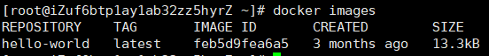
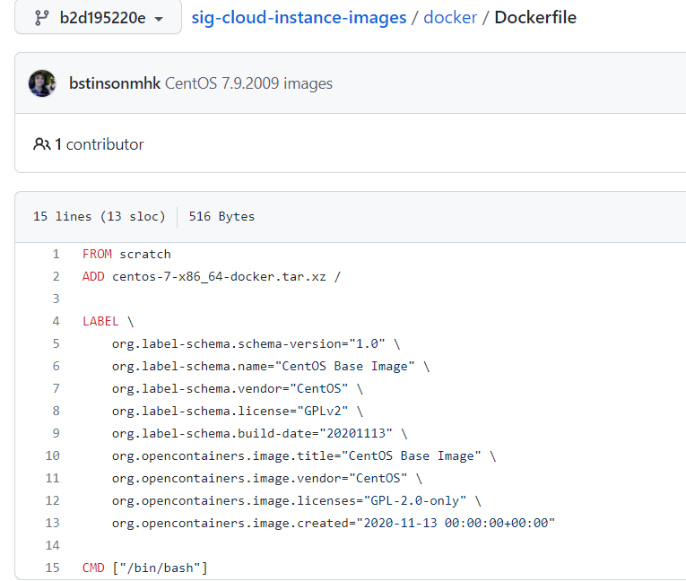
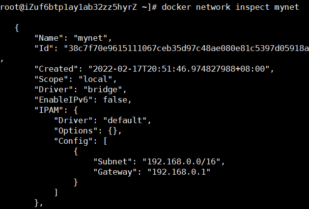

## 仓库命令

### docker login和logout

>  `docker login [options] [server]`     登录命令，如果不登陆默认为dockerhub

>  `docekr logout` 登出

options:

- -u ：登录的用户名
- -p : 登录密码

例子：

> docker login -u 用户名 -p 密码
>
> docker logout

### docker search

```
docker search [OPTIONS] TERM
```

OPTIONS说明：

- **--automated :**只列出 automated build类型的镜像；
- **--no-trunc :**显示完整的镜像描述；
- **-f <过滤条件>:**列出收藏数不小于指定值的镜像。

例子：

从 Docker Hub 查找所有镜像名包含 java，并且收藏数大于 10 的镜像

```bash
# docker search -f stars=10 java
NAME                  DESCRIPTION                           STARS   OFFICIAL   AUTOMATED
java                  Java is a concurrent, class-based...   1037    [OK]       
anapsix/alpine-java   Oracle Java 8 (and 7) with GLIBC ...   115                [OK]
develar/java                                                 46                 [OK]
isuper/java-oracle    This repository contains all java...   38                 [OK]
lwieske/java-8        Oracle Java 8 Container - Full + ...   27                 [OK]
nimmis/java-centos    This is docker images of CentOS 7...   13                 [OK]
```


## 镜像管理命令

### docker images

OPTIONS说明：

- **-a :**列出本地所有的镜像（含中间映像层，默认情况下，过滤掉中间映像层）；
- **--digests :**显示镜像的摘要信息；
- **-f :**显示满足条件的镜像；
- **--format :**指定返回值的模板文件；
- **--no-trunc :**显示完整的镜像信息；
- **-q :**只显示镜像ID。

>  `docker images`  查看镜像列表



### docker pull 和 push

>  docker pull [imageName]:[Tag]       从仓库拉去镜像

> docker push  [imageName]:[Tag]  向仓库中推送镜像

### docker rmi

> docker rmi [opt] [imageId或者imageName:tag]

OPTIONS说明：

- **-f :**强制删除:
- **--no-prune :**不移除该镜像的过程镜像，默认移除；

### docker tag

标记本地镜像，将其归入某一仓库

```
docker tag [OPTIONS] IMAGE[:TAG] [REGISTRYHOST/][USERNAME/]NAME[:TAG]
```

## 容器生命周期管理

### docker run

docker create和run类似，只不过create不启动。run是创建+启动

> docker run [OPTIONS] IMAGE [COMMAND] [ARG...]

OPTIONS说明：

- **--name="nginx-lb":** 为容器指定一个名称；

- **-d:** 后台运行容器，并返回容器ID；
- **-i:** 以交互模式运行容器，通常与 -t 同时使用；
- **-t:** 为容器重新分配一个伪输入终端，通常与 -i 同时使用；
- **-P:** 随机端口映射，容器内部端口**随机**映射到主机的端口
- **-p:** 指定端口映射，格式为：**主机(宿主)端口:容器端口**
- **-h "mars":** 指定容器的hostname；

- **-a stdin:** 指定标准输入输出内容类型，可选 STDIN/STDOUT/STDERR 三项；
- **--dns 8.8.8.8:** 指定容器使用的DNS服务器，默认和宿主一致；
- **--dns-search example.com:** 指定容器DNS搜索域名，默认和宿主一致；
- **-e username="ritchie":** 设置环境变量；
- **--env-file=[]:** 从指定文件读入环境变量；
- **--cpuset="0-2" or --cpuset="0,1,2":** 绑定容器到指定CPU运行；
- **-m :**设置容器使用内存最大值；
- **--net="bridge":** 指定容器的网络连接类型，支持 bridge/host/none/container: 四种类型；
- **--link=[]:** 添加链接到另一个容器；
- **--expose=[]:** 开放一个端口或一组端口；
- **--volume , -v:** 绑定一个卷

```shell

#测试
[root@iZuf6btp1ay1ab32zz5hyrZ ~]# docker run -it centos /bin/bash
[root@93d121bc7f81 /]# 
#退出
[root@93d121bc7f81 /]# exit
exit
```

### docker stop/start/restart

```bash
docker start 容器id或者容器名字              启动容器
docker stop 容器id或者容器名字               停止容器
docker restart 容器id或者容器名字            重启容器
```

### docker rm

**docker rm ：**删除一个或多个容器

```
docker rm [options] 容器id或者容器名字    
```

OPTIONS说明：

- **-f :**强制删除一个运行中的容器。
- **-l :**移除容器间的网络连接，而非容器本身。
- **-v :**删除与容器关联的卷。

docker rm -f $(docker ps -aq) 删除所有运行过的容器

### docker exec

**docker exec ：**在运行的容器中执行命令

```
docker exec [OPTIONS] CONTAINER COMMAND [ARG...]
```

OPTIONS说明：

- **-d :**分离模式: 在后台运行
- **-i :**即使没有附加也保持STDIN 打开
- **-t :**分配一个伪终端

eg: 进入正在运行的容器并且打开一个新的终端

```bash
docker exec -it 容器名字或者id /bash
# docker exec -it 容器id /bin/bash   进入容器后开启一个新的终端
[root@iZuf6btp1ay1ab32zz5hyrZ home]# docker exec -it e81c8b8af67 /bin/bash
[root@e81c8b8af67c /]# 

# docker attach 容器id   进入容器正在执行的终端
[root@iZuf6btp1ay1ab32zz5hyrZ home]# docker attach e81c8b8af67
[root@e81c8b8af67c home]# 
```

## 容器操作命令

### docker  ps

**docker ps :** 列出容器

```
docker ps [OPTIONS]
```

OPTIONS说明：

- **-a :**显示所有的容器，包括未运行的。
- **-f :**根据条件过滤显示的内容
- **--format :**指定返回值的模板文件。
- **-l :**显示最近创建的容器。
- **-n :**列出最近创建的n个容器。
- **--no-trunc :**不截断输出。
- **-q :**静默模式，只显示容器编号。
- **-s :**显示总的文件大小。

```bash
#docker ps命令
[root@iZuf6btp1ay1ab32zz5hyrZ ~]# docker ps 列出当前运行的容器
CONTAINER ID   IMAGE     COMMAND   CREATED   STATUS    PORTS     NAMES
[root@iZuf6btp1ay1ab32zz5hyrZ ~]# docker ps -a 列出所有运行过的容器
CONTAINER ID   IMAGE         COMMAND       CREATED         STATUS                          PORTS     NAMES
93d121bc7f81   centos        "/bin/bash"   4 minutes ago   Exited (0) About a minute ago             reverent_chebyshev
ddc65524d200   hello-world   "/hello"      4 days ago      Exited (0) 4 days ago                     tender_saha
[root@iZuf6btp1ay1ab32zz5hyrZ ~]# docker ps -n=1 最近1次运行的容器
CONTAINER ID   IMAGE     COMMAND       CREATED          STATUS                      PORTS     NAMES
93d121bc7f81   centos    "/bin/bash"   17 minutes ago   Exited (0) 14 minutes ago             reverent_chebyshev
[root@iZuf6btp1ay1ab32zz5hyrZ ~]# docker ps -n=2 最近倒数第二两次运行的容器
CONTAINER ID   IMAGE         COMMAND       CREATED          STATUS                      PORTS     NAMES
93d121bc7f81   centos        "/bin/bash"   18 minutes ago   Exited (0) 15 minutes ago             reverent_chebyshev
ddc65524d200   hello-world   "/hello"      4 days ago       Exited (0) 4 days ago                 tender_saha
```


### **退出容器**

```shell
退出并停止 exit
退出不停止 ctrl + P + Q
```

### docker inspect

**docker inspect :** 获取容器/镜像的元数据。

```
docker inspect [OPTIONS] NAME|ID [NAME|ID...]
```

OPTIONS说明：

- **-f :**指定返回值的模板文件。
- **-s :**显示总的文件大小。
- **--type :**为指定类型返回JSON。

### docker top

**查看容器内部进程**

```shell
# docker top 容器id
[root@iZuf6btp1ay1ab32zz5hyrZ home]# docker top e81c8b8af67c
UID                 PID                 PPID                C                   STIME               TTY                 TIME                CMD
root                5963                5944                0                   10:09               ?                   00:00:00            /bin/bash

```

### docker cp

**从容器内拷贝文件到主机上**

```shell
# docker cp 容器id:文件地址 外部地址
root@iZuf6btp1ay1ab32zz5hyrZ ~]# docker cp e81c8b8af67c:/home/test.java /home
[root@iZuf6btp1ay1ab32zz5hyrZ ~]# cd /home
[root@iZuf6btp1ay1ab32zz5hyrZ home]# ls
ggtoms  install-release.sh  local  report.log  v2ray-linux-64.zip
GGtoms  install.sh          nginx  test.java

```

### docker logs

**docker logs :** 获取容器的日志

```
docker logs [OPTIONS] CONTAINER
```

OPTIONS说明：

- **-f :** 跟踪日志输出
- **--since :**显示某个开始时间的所有日志
- **-t :** 显示时间戳
- **--tail :**仅列出最新N条容器日志

### commit镜像

```shell
# docker commit -m = "提交的描述信息" -a="作者" 容器id 目标镜像名：[TAG]

[root@iZuf6btp1ay1ab32zz5hyrZ ~]# docker commit -m="add webapps" -a="GGtoms" f54236fd1f67 tomcat_1:1.0
sha256:0b445fc59b6fc6f98a695d87cd8aee62f8544a96ae5fb7559ca2052f3f1cd66b
[root@iZuf6btp1ay1ab32zz5hyrZ ~]# docker images
REPOSITORY   TAG       IMAGE ID       CREATED          SIZE
tomcat_1     1.0       0b445fc59b6f   10 seconds ago   685MB
nginx        latest    605c77e624dd   2 weeks ago      141MB
tomcat       9         b8e65a4d736d   3 weeks ago      680MB
centos       latest    5d0da3dc9764   4 months ago     231MB

```

## 容器数据卷

### 什么是容器数据卷

Docker容器产生的数据，如果不通过docker commit生成新的镜像，使得数据可以做为镜像的一部分保存下来，当容器删除以后，容器中的数据也就没有了，为了使容器中的数据可以保存下来，我们使用卷。

### 使用数据卷

```shell
# docker run -it -v 镜像名 主机目录:容器内目录    -v为使用数据卷的参数
```

### 具名和匿名挂载

```shell
匿名挂在不指定主机目录
#docker run -v /etc/nginx nginx
查看所有 volumn 情况
#docker volumn ls


具名挂载
#docker run -v 卷名：容器内路径 镜像名

所有docker容器内的卷没有指定目录的情况下都在/var/docker/volumns/xxx/_data

设置文件权限
rw 可读可写
ro 只读，容器无法写入文件，只能由主机来写入
#docker run -v 主机目录：容器目录：rw　nginx
```


## Docker File

### **dockerfile命令**

- FROM- 镜像从那里来

- MAINTAINER- 镜像维护者信息                                                                                                               姓名加邮箱

- RUN- 构建镜像执行的命令，每一次RUN都会构建一层

- CMD- 容器启动的命令，如果有多个则以最后一个为准，也可以为ENTRYPOINT提供参数

- VOLUME- 定义数据卷，如果没有定义则使用默认

- USER- 指定后续执行的用户组和用户

- WORKDIR- 切换当前执行的工作目录

- HEALTHCHECH- 健康检测指令

- ARG- 变量属性值，但不在容器内部起作用

- EXPOSE- 暴露端口

- ENV- 变量属性值，容器内部也会起作用

- ADD- 添加文件，如果是压缩文件也解压

- COPY- 添加文件，以复制的形式

- ENTRYPOINT- 容器进入时执行的命令

### 实战测试

docker hub很多镜像都是从FROM scratch开始的



#### 创建自己的centos

##### 1.编写dockerfile文件

使用centos8会报错

```shell
FROM centos:7
MAINTAINER GGtoms<2633595553@qq.com>

ENV MYPATH /usr/local

WORKDIR $MYPATH

RUN yum -y install vim 
RUN yum -y install net-tools
EXPOSE 80

CMD echo $MYPATH
CMD echo "----------end---------"
CMD /bin/bash

```

##### 2.构建dockerfile

```shell
[root@iZuf6btp1ay1ab32zz5hyrZ dockerfile]# docker build -f dockerfile-centos -t mycentos:1.0 .


-f :指定要使用的Dockerfile路径；
--tag, -t: 生成的镜像的名字及标签，通常 name:tag 或者 name 格式；可以在一次构建中为一个镜像设置多个标签。
. :代表当前目录
```

##### 3.执行

```shell
[root@iZuf6btp1ay1ab32zz5hyrZ dockerfile]# docker run -it mycentos:1.0
#进入工作目录/usr/local
[root@1462079b8f66 local]# pwd
/usr/local
#vim安装成功
[root@1462079b8f66 local]# whereis vim
vim: /usr/bin/vim /usr/share/vim
#net-tools安装成功
[root@1462079b8f66 local]# whereis ifconfig
ifconfig: /usr/sbin/ifconfig


```

4.查看更改历史

```shell
[root@iZuf6btp1ay1ab32zz5hyrZ dockerfile]# docker history e3fbcc017542
IMAGE          CREATED          CREATED BY                                      SIZE      COMMENT
e3fbcc017542   12 minutes ago   /bin/sh -c #(nop)  CMD ["/bin/sh" "-c" "/bin…   0B       
bb2984c5fe78   12 minutes ago   /bin/sh -c #(nop)  CMD ["/bin/sh" "-c" "echo…   0B       
a39e2e9baec1   12 minutes ago   /bin/sh -c #(nop)  CMD ["/bin/sh" "-c" "echo…   0B       
92ad3eb30822   12 minutes ago   /bin/sh -c #(nop)  EXPOSE 80                    0B       
070755fa4b6e   12 minutes ago   /bin/sh -c yum -y install net-tools             155MB     
ad218e618390   12 minutes ago   /bin/sh -c yum -y install vim                   210MB     
528f23afb3f6   12 minutes ago   /bin/sh -c #(nop) WORKDIR /usr/local            0B      
03d6de9799f5   12 minutes ago   /bin/sh -c #(nop)  ENV MYPATH=/usr/local        0B       
b972b0767860   12 minutes ago   /bin/sh -c #(nop)  MAINTAINER GGtoms<2633595…   0B       
eeb6ee3f44bd   4 months ago     /bin/sh -c #(nop)  CMD ["/bin/bash"]            0B       
<missing>      4 months ago     /bin/sh -c #(nop)  LABEL org.label-schema.sc…   0B       
<missing>      4 months ago     /bin/sh -c #(nop) ADD file:b3ebbe8bd304723d4…   204MB  
```

## 自定义网络

bridge:桥接docker(默认)

none：不配置网络

host:和宿主机共享网络

container：容器网路互联局限性大

```bash
# --net bridge是默认配置
docekr run -d -p --name tomacat01 --net bridge tomcat
‘
#创建网络
# --driver是默认配置，可以不加
[root@iZuf6btp1ay1ab32zz5hyrZ ~]# docker network create --driver bridge --subnet 192.168.0.0/16 --gateway 192.168.0.1 mynet 
38c7f70e9615111067ceb35d97c48ae080e81c5397d05918ae7645fd42f9eb33
[root@iZuf6btp1ay1ab32zz5hyrZ ~]# docker network ls
NETWORK ID     NAME      DRIVER    SCOPE
ccdfbcc6603c   bridge    bridge    local
9664a724a70c   host      host      local
38c7f70e9615   mynet     bridge    local
ee48f0119532   none      null      local


[root@iZuf6btp1ay1ab32zz5hyrZ ~]# docker run -d -P --name tomcat-net-01 --net mynet tomcat:9
a3b2b4a4e21186b988c44f3435329b4dd2d05f0ee528b28a0064424a12d2d2a4
[root@iZuf6btp1ay1ab32zz5hyrZ ~]# docker run -d -P --name tomcat-net-02 --net mynet tomcat:9
712c12061fcbfe350cfcddef78ca34821d7e0b11e3c87baebc0dd362ee6b359d
[root@iZuf6btp1ay1ab32zz5hyrZ ~]# docker network inspect mynet
[
    {
        "Name": "mynet",
        "Id": "38c7f70e9615111067ceb35d97c48ae080e81c5397d05918ae7645fd42f9eb33",
        "Created": "2022-02-17T20:51:46.974827988+08:00",
        "Scope": "local",
        "Driver": "bridge",
        "EnableIPv6": false,
        "IPAM": {
            "Driver": "default",
            "Options": {},
            "Config": [
                {
                    "Subnet": "192.168.0.0/16",
                    "Gateway": "192.168.0.1"
                }
            ]
        },
        "Internal": false,
        "Attachable": false,
        "Ingress": false,
        "ConfigFrom": {
            "Network": ""
        },
        "ConfigOnly": false,
        "Containers": {
            "712c12061fcbfe350cfcddef78ca34821d7e0b11e3c87baebc0dd362ee6b359d": {
                "Name": "tomcat-net-02",
                "EndpointID": "8ebf0fb9da1b8ac521779926433718274287702b7bf4b80e32325b3900614412",
                "MacAddress": "02:42:c0:a8:00:03",
                "IPv4Address": "192.168.0.3/16",
                "IPv6Address": ""
            },
            "a3b2b4a4e21186b988c44f3435329b4dd2d05f0ee528b28a0064424a12d2d2a4": {
                "Name": "tomcat-net-01",
                "EndpointID": "abbc32630b4e079c6ae2b2dbac33ac1e4df408dde972cafc6457427ddbe10a60",
                "MacAddress": "02:42:c0:a8:00:02",
                "IPv4Address": "192.168.0.2/16",
                "IPv6Address": ""
            }
        },
        "Options": {},
        "Labels": {}
    }
]

```



## Redis集群

shelljiaoben

```bash
for port in $(seq 1 6); \
do \
mkdir -p /mydata/redis/node-${port}/conf
touch /mydata/redis/node-${port}/conf/redis.conf
cat << EOF >/mydata/redis/node-${port}/conf/redis.conf
port 6379 
bind 0.0.0.0
cluster-enabled yes 
cluster-config-file nodes.conf
cluster-node-timeout 5000
cluster-announce-ip 172.38.0.1${port}
cluster-announce-port 6379
cluster-announce-bus-port 16379
appendonly yes
EOF
done
```

