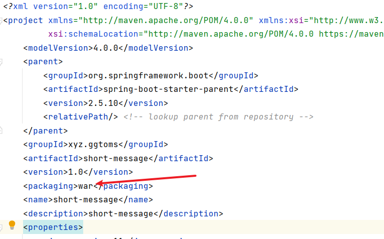
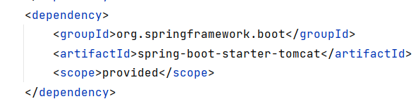
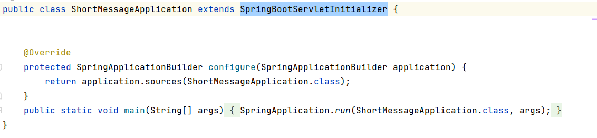
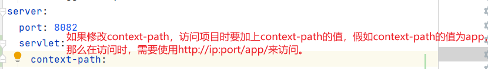
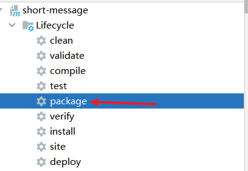
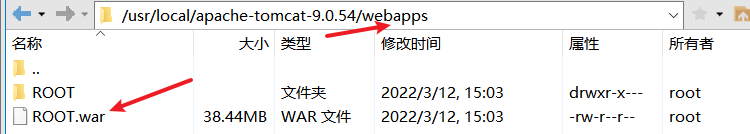

# springboot 打包使用tomcat运行

> 1.将maven打包方式改为war

> 2.将springboot的tomcat依赖的scope改为provided

> 3.springboot启动类继承SpringBootServletInitializer

> 4.修改application.xml

> 5.maven打包

> 6.上传到tomcat安装目录下的webapps文件夹

如果没有修改context-path的值，可以将war包命名为ROOT，这样不用在路径前加context-path。

ps:可以把原先在webapps里面的文件给删了。

> 7.启动tomcat